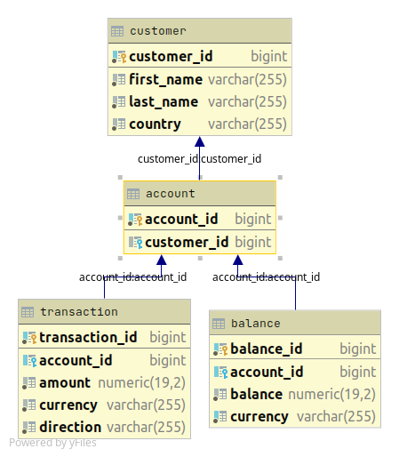

# Description
A banking software implementing REST api.

# Technology 
<ul>
<li>Java 11</li>
<li>Spring Boot</li>
<li>Gradle</li>
<li>Postgres</li>
</ul>

# Database


# API
https://documenter.getpostman.com/view/14063258/TzCP8Tgb

## Health
*Get request to /health*<br>
You will receive OK if server is alive

## Create Account
Creates a bank account for the customer and returns an object together with balance object.
#### Input
*Post request to /accounts with a json file contraining following fields* 
```json
{
"customerId": 1,
"firstname": "Shahriar",
"lastname": "Tanvir",
"country": "Bangladesh",
"currencies": ["BDT", "USD"]
}
```

#### Output
```json
{
    "accountId": 5,
    "customerId": 1,
    "balances": [
        {
            "balance": 0,
            "currency": "BDT"
        },
        {
            "balance": 0,
            "currency": "USD"
        }
    ]
}
```
## Get account
Return the account object.
#### Input
*Get request to /accounts/{account_id} with account id as path variable*
#### Output
```json
{
    "accountId": 2,
    "customerId": 1,
    "balances": [
        {
            "balance": 400.00,
            "currency": "BDT"
        },
        {
            "balance": 100.00,
            "currency": "USD"
        }
    ]
}
```
## Create Transaction
Create a transaction on the account and return the transaction object.
#### Input
*Post a json object to /transactions with following fields*<br>
***Remember direction is of 2 types: IN and OUT**
```json
{
    "accountId" :2,
    "amount" : 100,
    "currency": "BDT",
    "direction": "OUT"
}
```
#### Output
```json
{
    "transactionId": 12,
    "accountId": 2,
    "amount": 100,
    "currency": "BDT",
    "direction": "OUT",
    "balance": 300.00
}
```
## Get Transaction
Returns a list of all transactions of an account.
#### Input
*Get request to /transaction/{account_id} with account id as path variable*
#### Output
```json
[
    {
        "transactionId": 8,
        "accountId": 2,
        "amount": 500.00,
        "currency": "BDT",
        "direction": "IN",
        "balance": null
    },
    {
        "transactionId": 9,
        "accountId": 2,
        "amount": 100.00,
        "currency": "USD",
        "direction": "IN",
        "balance": null
    }
]
```
